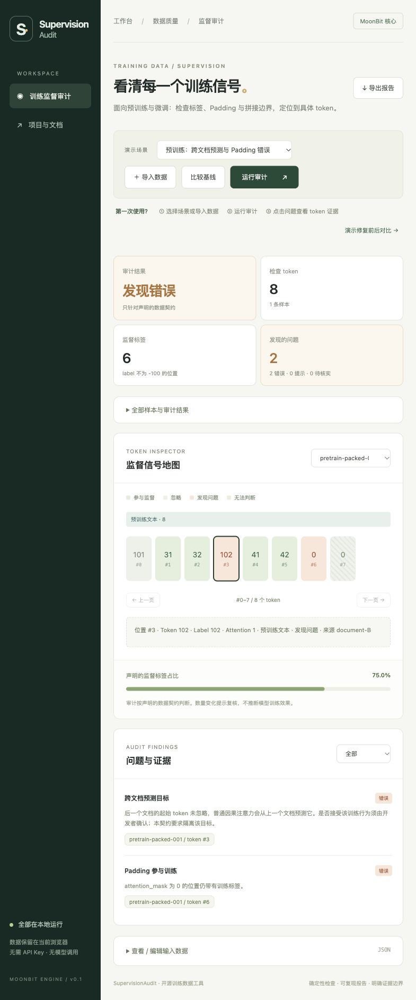
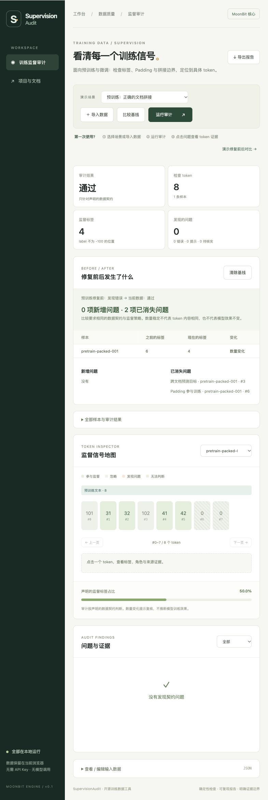

# SupervisionAudit

**训练开始前，先看清哪些 token 真正参与了训练。**

SupervisionAudit 是用 MoonBit 编写的训练数据审计工具。它读取已经分词的预处理结果，检查标签、Padding、监督范围和文档拼接边界，把问题定位到具体样本与 token。支持纯文本预训练、继续预训练，以及符合相同标签契约的对话微调数据。

> 当前是可运行原型，尚未完成赛事验收、端到端训练验证或 Mooncakes 发布。演示语料均为合成文本；已补充固定版本 tokenizer / collator 导出，以及微型随机模型的损失和梯度验证。工具不执行模型训练，也不证明模型效果。

## 它解决什么问题

| 你遇到的情况 | 工具会告诉你什么 |
| --- | --- |
| 预训练时拼接了两份文档 | 后一份文档的首个 token 是否从前一份文档产生预测目标 |
| 给短样本补齐长度 | Padding 是否被错误地写入训练标签 |
| 只想训练助手回复 | 用户、系统或工具内容是否误入监督范围 |
| 改了截断或预处理逻辑 | 声明的监督数量有没有减少、哪些问题新增或消失 |
| 导出的记录没有来源信息 | 明确显示“需复核”，保留无法验证的部分 |

例如，两份文档拼接后，第二份文档的起始位置是 token #3。若这个位置的 label 仍为 token ID，本工具的边界隔离策略会报告 `PACKING_CROSS_SOURCE_TARGET`。把它改成 `-100` 后重跑，可看到该问题消失。**忽略这一目标不等于阻止后续 token 注意到前一份文档**；需要完整注意力隔离的训练流程仍须在训练器中实现。本工具也不认定所有跨文档预测都天然错误：请确认本契约的策略适合你的训练任务。

## 三分钟跑起来

先安装 [官方 MoonBit 工具链](https://docs.moonbitlang.com/en/latest/first-steps.html)，并准备 Node.js 22 或更新版本。

```sh
git clone https://github.com/FidollarinLA/supervision-audit.git
cd supervision-audit
npm run build
npm run dev
```

打开 **http://127.0.0.1:4317**。无需 API Key、模型下载或 npm 运行依赖。

1. 选择“预训练：跨文档预测与 Padding 错误”，查看审计结果。
2. 点击“问题与证据”中的位置，检查对应 token、label 和来源。
3. 点击“演示修复前后对比”，查看修复后的结果及消失的问题。
4. 导入自己的 JSON 或 JSONL，确认监督策略，再运行审计。
5. 导出完整 JSON 报告。大样本按每页 120 个 token 查看，问题列表最多显示前 200 项；报告保留完整结果。

比较基线以最后选择的文件为准；旧文件即使稍后才读完，也不会覆盖新基线。清除基线后，旧读取结果不会重新出现。

审计与修复比较在浏览器后台 Worker 中计算。运行时可点击“取消审计”，保留输入后重新运行；修改输入或切换场景也会终止旧计算。需要支持模块 Worker 的浏览器，不支持时可使用 CLI。文件大小与样本预算保持不变，尚不支持流式大文件处理，详见[后台审计与取消](docs/background-audit.md)。

<details>
<summary>查看实际界面截图（合成预训练数据）</summary>





</details>

本地服务器只提供静态资源。训练文件由浏览器读取并在浏览器中处理，没有上传接口，不调用第三方模型或分析服务。数据仍可能包含私密内容，分享导出报告前请自行核对。

## 最小输入示例

下面是一份完整的纯文本预训练审计文档。角色 `text` 表示普通语料；`-100` 表示忽略标签。

```json
{
  "contract": "causal-lm-unshifted-v1",
  "allowed_roles": ["text"],
  "samples": [{
    "id": "document-001",
    "input_ids": [101, 42, 43],
    "labels": [-100, 42, 43],
    "attention_mask": [1, 1, 1],
    "spans": [{"start": 0, "end": 3, "role": "text"}],
    "segments": [{"start": 0, "end": 3, "source_id": "article-A"}]
  }]
}
```

三个数组必须等长。所有区间都是 token 索引的左闭右开区间 `[start, end)`，不是字符偏移。对话数据的角色为 `system`、`user`、`assistant`、`tool`，由 `allowed_roles` 明确指定哪些角色可以参与监督。

JSONL 每行是一个已分词的样本，省略外层 `contract`、`allowed_roles` 和 `samples`。角色与来源字段可以缺失，但相关检查会保留未知状态。界面的 JSONL 策略只影响 JSONL；JSON 文档使用自身的 `allowed_roles`。具体见 [输入格式与边界](docs/contract.md)。

## 命令行与训练前检查

```sh
# 正常预训练数据：退出码 0；终端显示中文摘要
node cli.mjs examples/pretraining.json --summary

# 有故障的预训练数据：退出码 1
node cli.mjs examples/pretraining-boundary.json

# 已分词的 JSONL，明确指定纯文本策略
node cli.mjs dataset.jsonl --jsonl --roles text --out report.json

# 对比同一契约、同一策略的两个版本
node cli.mjs examples/pretraining.json --baseline examples/pretraining-boundary.json --out comparison.json
```

| 退出码 | 含义 |
| --- | --- |
| `0` | 审计通过；比较模式下仅表示比较成功执行 |
| `1` | 审计发现错误 |
| `2` | 文件、JSON 或命令输入错误 |
| `3` | 需要人工复核，包括证据不足与提示项 |

`--summary` 将中文摘要写入标准错误流，标准输出仍只包含完整 JSON；配合 `--out report.json` 可保存报告并在终端查看摘要。摘要列出审计状态、声明监督标签数和前五项问题，完整报告不截断。摘要另列“位移后预测目标”：排除首位置后未忽略的标签数；无法完整计算时显示“无法计算”。错误 Padding 标签也会计入目标，所以数量不能替代审计结论。比较摘要明确显示前后审计状态，即使新数据失败，比较成功执行仍返回 `0`。

参数拼写错误、重复选项、缺少参数值会返回 `2`。`--roles` 仅用于 JSONL；比较模式只接受 JSON 文档，不能与 `--jsonl` 混用，避免配置被静默忽略。

接入 CI 时可以直接使用审计退出码阻止有错误的数据继续进入训练。比较模式的 `0` **不代表新数据更好**。导出中的 `report.schema_version` 为 `supervision-audit/report/v1`，比较结果则使用 `comparison.schema_version`，详见[报告版本与旧数据处理](docs/report-format.md)。格式版本与训练输入契约是两回事。JSON 报告中 `status` 为 `pass`、`review` 或 `fail`；`findings` 包含问题代码、严重程度、样本 ID、token 索引和说明。

## 从实际预处理流程导入

仓库包含 Transformers 4.57.1 tokenizer / collator 实际生成的微型批次，可直接检查：

```sh
node cli.mjs examples/transformers/batch.jsonl --jsonl --roles text --summary
```

预期为“需复核”（退出码 `3`）：保留原始 collator 标签后，三个样本的首位置都会出现“不产生预测”的提示，单 token 样本另有“位移后没有预测目标”提示；Padding 标签正确。没有为了得到“通过”而改写标签。语料仍为本仓库合成文本，不代表生产数据验证。

[重建步骤、来源与边界](docs/transformers-integration.md)包括固定版本依赖、离线生成、结果逐字节对照和故障注入测试。运行现有导出结果不需要安装 Python 或训练框架。另有[模型损失对照实验](docs/model-loss-reference.md)：实际运行微型随机 GPT-2，核对首位置、Padding、助手回复和文档边界的损失与梯度；不下载预训练权重。

还可导入 `examples/transformers/truncate-left/batch.jsonl` 或 `truncate-right/batch.jsonl`，查看实际左右截断后的监督减少：声明标签由 13 降至 9，预测目标由 10 降至 6。清单保留原始 token 范围，模型实验核对截断后的损失位置；这仍是 WordLevel 合成语料实验。

## MoonBit 核心与可复用接口


所有审计判断、JSONL 标准化和差异计算都由 MoonBit 实现。JavaScript 负责文件读写、静态服务和界面呈现。

| 文件 / 接口 | 用途 |
| --- | --- |
| `audit.mbt` / `audit(Document) -> Report` | 契约验证、逐 token 审计与证据输出 |
| `adapters.mbt` / `audit_jsonl` | 已分词 JSONL 转换及审计，返回标准化 document 与 report |
| `comparison.mbt` / `compare(Report, Report) -> Comparison` | 按样本 ID 和问题位置比较，用索引避免重复扫描问题集合 |
| `audit_json`、`compare_json` | 编译到 JavaScript 后的字符串输入 / 输出接口 |
| `web/` | 本地可视化工作台 |
| `cli.mjs` | 离线命令行入口 |

MoonBit 模块名为 `FidollarinLA/supervision_audit`，公开类型与接口见 [pkg.generated.mbti](pkg.generated.mbti)。尚未发布至 Mooncakes，当前请从源码构建；不提供尚不能使用的包安装命令。

已有独立消费者验证：在 Git 检出目录执行 `npm run check:package`，会生成实际发布归档，解压到临时目录，再由另一个 MoonBit 模块调用公开接口，分别测试 JS、Wasm GC 和 native。需要 `git`、`unzip` 和 native 编译环境；这不执行发布，也不验证注册表安装。接入示例与复现范围见[本地包复现](docs/package-rehearsal.md)。

## 能力边界

- 只支持 `causal-lm-unshifted-v1`：模型内部做下一 token 位移，labels 与 input_ids 同位置对齐。提前位移的标签、MLM 和多模态标签尚不支持。
- attention_mask 是逐 token 的 0/1 数组，不支持 block-diagonal attention 或其他注意力隔离机制。
- 不推测 tokenizer 的语义，也不从缺失字段猜测角色或来源。
- 声明监督数量包含首位置标签；新增的位移后预测目标数排除首位置。样本或整体无法完整计算时显示“无法计算”；仅首标签样本会提示没有预测目标。数量可能包含错误目标，不等同于合法监督数量。
- “数量稳定”仅表示样本 token 数和监督数量不变，不保证内容一致。
- 文件导入最多 1 MiB；核心字符串入口最多 1,048,576 UTF-16 单位、200 条样本，单样本 10,000 个 token，整份文档最多 100,000 个 token。区间展开也有单样本预算。超限会报告错误，不会声称完整通过。

## 验证与后续迭代

```sh
moon check --target js --deny-warn
moon test --target js --deny-warn
moon test --target wasm-gc --deny-warn
moon test --target native --deny-warn
moon info
moon fmt
npm run build
npm test
npm run check:package
npm run benchmark
```

测试覆盖预训练拼接、Padding、角色策略、JSONL 证据不足、资源边界、CLI 退出码、修复对比和界面状态。独立 JavaScript 判定器核对 128 组固定种子策略组合；大问题集合测试检查 2,999 项诊断的完整消除。基准测试是本机合成数据测量，不能代表真实训练速度。

[审核自查](https://github.com/FidollarinLA/supervision-audit/blob/main/docs/review-2026-10-03.md) · [迭代路线](docs/ROADMAP.md) · [演示步骤](docs/demo.md) · [开发记录](https://github.com/FidollarinLA/supervision-audit/blob/main/docs/WORKLOG.md)

## 原创贡献与许可证

Apache-2.0。MoonBit 核心独立编写，与 MoonMask 的生成时约束模块独立。本项目没有移植 Teich 代码，也不宣称全球首创；相关工具、许可证和合成数据来源见 [THIRD_PARTY.md](THIRD_PARTY.md)。AI 辅助开发须由参赛者理解、核查和维护，申报草稿不等于本人撰写的最终提交件。
