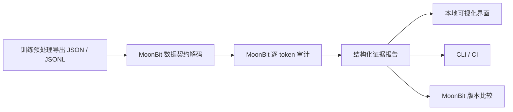

# 架构与迭代路线

## 设计决定

审计核心不用大模型判断，不依赖 Python 推理框架。所有错误、提示和未知状态由 MoonBit 产生；JavaScript 只处理文件、界面和启动服务。JSONL 缺少元数据时返回未知，不能把缺省角色推断成助手。报告不改写输入，不自动修复用户数据。

## 已实现

0.1：固定标签契约、类型化接口、检查规则、资源边界、六类合成示例、JSONL、CLI、token 查看器、导出、版本比较、跨后端测试。

## 下一步

0.2：为一个固定版本的真实训练预处理流程建立适配器和可复现导出，保留 tokenizer/模板版本、角色区间生成依据和训练器的参考标签。人工复核数据，记录对照差异。

0.3：大文件流式审计、错误采样、批量报告与内存性能基准。超过首版资源边界的大数据当前应先分批处理。

0.4：以独立契约支持 attention 隔离、不同 label shift、EOS 和 packing 策略，验证后才宣布支持；提供 Mooncakes 包并验证外部消费者。

## 月赛交付节奏

10 月 2 日建立可运行原型与公开仓库；之后先补真实流程证据，再完善 API 与性能。10 月下旬完成来源检查、干净环境复现、演示和申报承诺核对。截止以官方实际通知为准，不能以此路线替代赛事安排。
